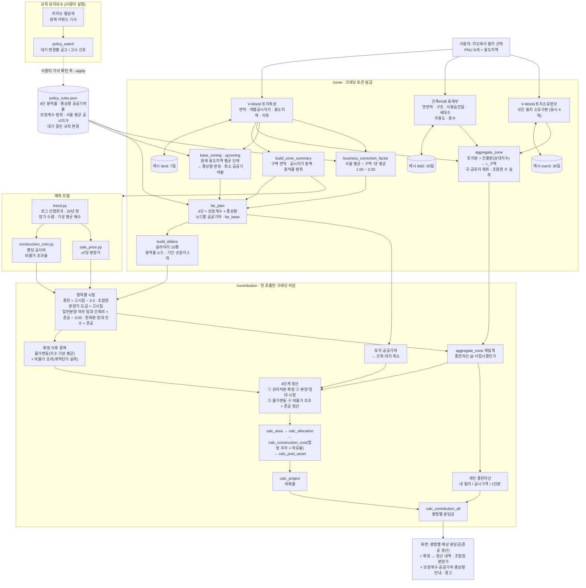
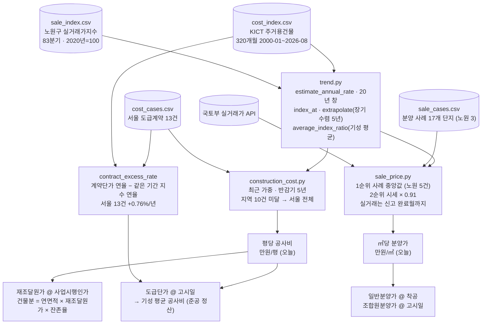

# 얼마GEO 계산 파이프라인

재개발 예상 분담금 계산 엔진의 전체 흐름. 2026 KW 해커톤 / 대상지 서울 노원구 월계1동.
최종 갱신 2026-10-07 — 준공 정산(확정 이후 증액) · 사업성 보정계수 · 종상향 · 상한용적률 공공기여 · 규칙 유지보수 ·
주차 여유율(법정 × 실측) · 국공유지 제외(토지소유정보) · 재조달원가 상대지수 · 분양가 노원 사례·실거래 신고 완료월.

> **이 문서로 모식도를 그릴 때**: 아래 Mermaid를 그대로 써도 되고,
> 「노드 정의」·「엣지 목록」 표만 보고 원하는 스타일로 다시 그려도 된다.
> 두 표가 Mermaid와 같은 내용을 담고 있다.

**한 줄 요약**
지도에서 필지를 고르면 → 공공 API로 토지·건물을 전수 조회해 종전자산을 쌓고 →
서울시 정비기본계획의 용적률 체계(4단·보정계수·종상향·공공기여)로 신축 규모를 만들고 →
관리처분 때 확정되는 값과 준공 때까지 오르는 공사비를 나눠 계산해 →
**준공 때 정산되는 평형별 분담금**과 그 내역을 한 번에 보여준다.

```
분담금 = 조합원분양가 − 권리가액
권리가액 = 개인 종전자산 × 비례율
비례율 = (종후자산 − 총사업비) ÷ 종전자산 총액 × 100
```

---

## 1. 전체 흐름



### 노드 정의

| ID | 이름 | 계층 | 하는 일 | 출력 |
|---|---|---|---|---|
| PR | `policy_rules.json` | 규칙 데이터 | 서울시 기본계획·조례 숫자를 코드 밖에 둔다 | 4단 표, 종상향 공공기여율, 보정계수 범위, 서울 평균 공시지가, 대기 변경 |
| VW | V-World 토지특성 | 외부 API | 필지별 토지 정보 조회 | 면적, 개별공시지가, 용도지역, 지목 |
| BL | 건축HUB 표제부 | 외부 API | 필지별 건물 정보 조회 | 연면적, 구조, 사용승인일, 세대수, 주용도, 층수 |
| OWN | V-World 토지소유정보 | 외부 API | 모든 필지의 소유구분 (동시 4개, 캐시 30일) | 개인·법인·기타단체·국유지·시·도유지·군유지 |
| ZS | `build_zone_summary` | 엔진 | 구역 집계 + 용적률 범위 | 대지면적, 공시지가 총액, far_min/far_max |
| BZ | `base_zoning` · `upzoning` | 엔진 | 원래 용도지역의 면적가중 평균 단계 → 고른 용도지역과 비교 | 기준 용도지역, 올린 단계, 최소 공공기여율 |
| BC | `business_correction_factor` | 엔진 | 서울시 평균 공시지가 ÷ 구역 '대' 필지 평균 | 보정계수 k (1.00~2.00) |
| FP | `far_plan` | 엔진 | 4단 + k + 종상향 + 상한 산식 | 노드(값·단계명·공공기여), far_base |
| AG | `aggregate_zone` | 엔진 | 종전자산 전수 집계 (국·공유지 제외, 건물분 × 재조달원가 상대지수) | 토지분, 건물분, r_구역, 조합원 수 |
| SB | `build_sliders` | 백엔드 | 조절 변수 구성 | 슬라이더 10종 (용적률 노드에 공공기여 비율) |
| TR | `trend.py` | 모델 | 지수에서 연율 추정, 시점 이동 | 연평균 상승률, `index_at`, `average_index_ratio` |
| CC | `construction_cost.py` | 모델 | 평당 공사비 예측, 비물가 초과율 | 만원/평, `contract_excess_rate` |
| SP | `sale_price.py` | 모델 | ㎡당 분양가 예측 | 만원/㎡ |
| TL | 항목별 시점 | 백엔드 | [고시일, 최종 인가] → 항목마다 다른 시점 | 고시일·착공·준공·평가시점 연월 |
| ESC | 확정 이후 증액 | 백엔드 | 도급단가 → 기성 평균 공사비 | 물가변동 배수, 비물가 배수 |
| NET | 토지 공공기여 | 백엔드 | 고른 노드의 기부 비율만큼 대지 축소 | 건축 대지면적 |
| A5 | `aggregate_zone` 재집계 | 엔진 | 평가시점 종전자산 | 종전자산 총액 |
| ST | 4단계 정산 | 백엔드 | 같은 면적으로 가격·비용 시점만 바꿔 4번 계산 | 단계별 비례율·분담금 |
| A1 | `calc_area` ~ `calc_post_asset` | 엔진 | 연면적 → 세대 배분 → 비용(지하 = 법정 주차 × 여유율) → 수입 | 총사업비, 종후자산 |
| A6 | `calc_project` | 엔진 | 사업 수지 | 비례율 |
| OW | 개인 종전자산 | 백엔드 | 3분기 선택 | 개인 종전자산, ρ |
| A7 | `calc_contribution_all` | 엔진 | 평형별 계산 | 평형별 분담금, 분양가 대비 비율 |
| NW | 카카오 웹검색 | 외부 API | 대기 변경의 검색어로 기사 수집 | 기사 목록 |
| PW | `policy_watch` | 유지보수 | 기사 ↔ 대기 변경 매칭, 고시 신호 표시 | 검토 목록, `--apply` 로 규칙 파일 갱신 |

### 엣지 목록

| From | To | 전달하는 것 |
|---|---|---|
| 사용자 | VW, BL | PNU 목록, 선택 용도지역 |
| VW | ZS, AG, BZ, BC | 면적, 공시지가, 원래 용도지역, 지목 |
| BL | AG | 연면적, 구조, 경과연수, 세대수, 주용도·층수(→ 상대지수) |
| OWN | AG | 소유구분 (국·공유지면 제외) |
| PR | BZ, BC, FP | 공공기여율 표, 보정계수 범위·서울 평균, 4단 표·상한 산식 계수 |
| ZS, BZ, BC | FP | 용적률 범위·대표 용도지역, 기준 용도지역, k |
| FP | SB, NET | 노드·공공기여 비율, far_base |
| ZS | 모델 | 지역 코드 |
| TR | CC, SP | 연율, 지수 보정 함수 |
| SB, CC, SP | TL | 오늘 기준 공사비·분양가, [고시일, 최종 인가] |
| TL | ESC, A5 | 고시일·착공·준공 시점, 평가시점 |
| AG | A5 | 필지 원자료 배열 |
| ESC, NET, A5 | ST | 증액 배수, 건축 대지, 종전자산 총액 |
| ST | A1 → A6 | 단계별 ProjectParams |
| A5 | OW | 구역 총액 · 1인분 |
| A6, OW | A7 | 비례율, 개인 종전자산 |
| NW | PW | 기사 (제목·본문·URL·날짜) |
| PW | PR | 사람이 확인한 변경 (`--apply`, 기사 URL 기록) |

---

## 2. 모델 파이프라인



**공사비가 세 시점에 쓰인다** — 종전자산 건물분의 재조달원가(사업시행인가), 도급단가(고시일),
기성 지급(착공~준공). 같은 값을 쓰면 안 된다.

**비물가 초과율은 반드시 같은 기간끼리 비교한다.** 사례 연율(4.64%)을 지수의 20년 평균(3.97%)과
비교하면, 사례 기간에만 있던 2021~22 급등이 초과분으로 잘못 잡힌다 (노원 8건이면 1.42% → 2.79% 로 두 배).

---

## 3. 시점 규칙 — 가장 틀리기 쉬운 부분

사업 기간 슬라이더는 손잡이가 두 개다 — **[분담금 고시일, 최종 인가]**, 기본 **[13, 21]년 후**.
두 손잡이를 따로 1년씩 움직인다. 사이는 최소 3년(서울 아파트 공사기간 중앙값 3.05년)만 지키고 최대 제한은 없다 (2026-10-08).

| 항목 | 시점 (기본값) | 성격 | 근거 |
|---|---|---|---|
| 분담금 고시일 (관리처분인가) | 13년 후 | 실측 중앙값 | 구역지정 → 관리처분 40건 중앙값 13.4년 (생존편향 있음) |
| **종전자산 평가** | 고시일 − 3.3 = 9.7년 후 | **법정** + 실측 간격 | 사업시행계획인가 고시일 (도시정비법 제74조①5호), 간격 중앙값 3.3년 |
| 조합원분양가 · 공사비 도급 | 고시일 | 제도 | 관리처분계획에서 명목 확정 — 이후 조합원분양가는 오르지 않는다 |
| 일반분양가 | 최종 인가 − 3.05 = 17.95년 후 | 관행 | 착공 무렵 분양 |
| 공사비 기성 | 착공 ~ 최종 인가 월평균 | 계약 | 도급계약 물가변동 조정은 지급 시점 물가를 따른다 |
| 의무 임대 건물 (재개발) | 일반분양 공고 = 착공 = 17.95년 후 | **법정** | 일반분양 공고일 직전에 고시된 기본형건축비(지상층 + 지하층)의 80% (시행령 제68조②1, 2025-03-18 시행 · 서울시 조례 제41조①). 부속토지는 사업시행인가 시점 감정가 |
| 완화분 임대 건물 (제54조) | 최종 인가 = 21년 후 | **법정** | 준공 때 표준건축비(지하층 63%)로 인수, 부속토지는 기부채납 (도시정비법 제55조② 현행) |
| 최종 인가 (준공) | 21년 후 | 실측 합 | 13.4 + 관리처분→착공 4.3 (18건) + 착공→준공 3.05 (서울 25개 구 133개 단지 건축물대장 착공일→사용승인일 중앙값 36.6개월) |

```
토지분      = 공시지가 × λ × (1 + g_L)^(고시일 − 3.3)
건물분      = 연면적 × 재조달원가@(고시일−3.3) × 잔존율(경과연수 + 고시일 − 3.3)
조합원분양가 = 일반분양가@고시일 × 조합원분양가 비율           ← 시점 계수로 고정
  비율 (기본 자동) = ① 관리처분 확정 비례율이 100% 가 되는 값      ← calc.solve_member_price_ratio (비례율이 비율의 1차 함수라 두 점으로 정확히 푼다)
공사비@정산 = 도급단가@고시일 × 물가변동 배수 × 비물가 배수
  물가변동 배수 = 착공~준공 월평균 지수 ÷ 고시일 지수            (기본 ×1.27)
  비물가 배수   = (1 + 0.76%)^(지급월 − 고시일) 의 월평균        (기본 약 ×1.05)
기타사업비   = 고시일 금액에 고정 (확정 이후 증액은 도급 공사비에만)
```

### 4단계 정산

같은 면적·세대 배분으로 가격·비용의 시점만 바꿔 네 번 계산한다. ④가 화면의 예상 분담금이다.
조합원분양가 비율은 ①에서 정해(자동이면 비례율 100% 역산) 네 단계 모두 같은 값을 쓴다.
시점 보정(②~④)은 비율과 무관하게 비례율을 같은 %p 만큼 움직인다 → 조합원별 추가분담금 = 종전자산 × 그 %p.

| 단계 | 일반분양가 | 조합원분양가 | 의무 임대 건물 | 완화분 임대 건물 | 공사비 |
|---|---|---|---|---|---|
| ① 관리처분 확정 | 고시일 | 고시일 | 고시일 | 고시일 | 도급단가 |
| ② 분양·임대 시점 반영 | 착공 | 고시일 (고정) | 착공 (일반분양 공고) | 준공 | 도급단가 |
| ③ 공사비 물가변동 | 착공 | 고시일 | 착공 | 준공 | × 물가변동 |
| ④ 비물가 초과 증액 = 준공 정산 | 착공 | 고시일 | 착공 | 준공 | × 물가변동 × 비물가 |

건물은 평가시점까지 **더 낡고**(잔존율 ↓) 재조달원가는 **오른다**(공사비 ↑).
**상쇄 정도가 구조마다 다르다** → 구역 평균 한 배수로 밀 수 없어 필지 단위로 재계산한다.

| 구조 | 잔존율 변화 (22년 → 31.7년) | 재조달원가 | 순효과 |
|---|---|---|---|
| 철근콘크리트 (연 2.0% 상각) | 0.56 → 0.37 | ×1.459 | **−4.6%** |
| 벽돌 (연 3.0%, 하한 0.10 도달) | 0.10 → 0.10 | ×1.459 | **+45.9%** |

---

## 4. 약분 구조 — 이 설계의 핵심

### 문제

종전자산을 "공시지가 × 단일 배수 r"로 두면 분담금에서 r이 사라진다.

```
권리가액 = (P_i × r) × [사업이익 ÷ (L × r)]
         = P_i × 사업이익 ÷ L                 ← r 소거
```

보정률을 아무리 정교하게 추정해도 분담금이 1원도 움직이지 않았다.
게다가 실측도 구조적으로 막혀 있다 — 관리처분까지 간 구역은 공시지가가 미공시고,
공시지가가 있는 구역은 관리처분 자료가 없다.

### 해결

**건물분을 분리한다.** 개인은 "내 건물", 구역은 "모든 건물의 합"이라 값이 달라진다.

```
r_개인 = λ + 건물분_i ÷ 공시지가_i
r_구역 = λ + Σ건물분 ÷ Σ공시지가
ρ = r_개인 ÷ r_구역        ← 1이 아니면 약분이 깨진 것
```

| ρ | 의미 | 분담금 |
|---|---|---|
| ρ > 1 | 내 건물이 구역 평균보다 새것 | 감소 |
| ρ = 1 | 구역 평균 조합원 (내 필지 미지정) | 기준 |
| ρ < 1 | 내 건물이 더 낡음 또는 나대지 | 증가 |

**ρ를 따로 추정하지 않는다.** 개인과 구역을 같은 식으로 계산하면 결과로 나온다.
새 입력은 건축물대장뿐이고 전부 L1(법정·API)이다. 회귀나 학습이 없다.

---

## 5. 용적률 계획 — 4단 · 보정계수 · 종상향 · 공공기여

서울시 「2030 도시·주거환경정비기본계획(주거환경정비사업부문)」 재정비 (2024-08-22 보도자료)를 그대로 따른다.
숫자는 `AI/engine/data/policy_rules.json` 에 있다.

```
기준 ──(인센티브 × 보정계수 k)──→ 허용 ──(공공기여)──→ 상한 ──(도시정비법 제54조 임대)──→ 법적상한
```

| 용도지역 | 기준 | 허용 | 상한 | 법적상한 |
|---|---|---|---|---|
| 1종일반 | 150 | 150 | 200 | 200 |
| 2종일반 | 190 | 210 | 250 | 250 |
| 3종일반 | 210 | 230 | 250 | 300 |
| 준주거 | 300 | 320 | 400 | 500 |
| 종상향 1종 → 2종 / 3종 | 150 | 170 | 200 / 250 | 250 / 300 |
| 종상향 2종 → 3종 | 190 | 210 | 250 | 300 |
| 종상향 3종 → 준주거 | 210 | 230 | 400 | 500 |

- **사업성 보정계수** (서울시 「정비사업 사업성 개선방안 세부기준」) 1.00~2.00, 각 항 셋째자리 올림 후 합산.
  허용 = 기준 + 인센티브량 × k, 상한도 같은 폭 (법적상한 불변)
  - 재개발 : 서울시 평균 공시지가(1·2종 대지, 2025년 6,302,982원/㎡) ÷ 구역 '대' 필지 면적가중평균
  - 재건축 : 서울시 공동주택 평균 공시지가 (2023 7,192,258 세부기준 · 2024 7,274,646 서울특별시공고 제2025-9호 ·
    2025 8,043,979 공고 제2026-529호) ÷ 단지 평균. 2025년에 산정 방식이 바뀌어(+10.6%) 연도 맞춤 상승률은 재개발 계열로 한다
    \+ α 대지면적(2만㎡ 미만 단지 0.10~0.20) + β 세대밀도(세대당 공급 110㎡ 미만 0.10~0.20)
- **재건축 과밀단지** : 현황용적률(건축물대장 용적률 산정 연면적 ÷ 단지 대지)이 허용(보정 전)보다 높으면
  현황을 허용으로 인정하고 20%p × (k − 1) 까지 더한다 (현황 270%·k 2.0 → 290%, 세부기준 예시와 같음). 3종을 유지하면 300% 까지
- **허용 300% 이상 과밀단지 + 준주거 종상향** (세부기준 p.5~6 체계도) : 기준 210 · 허용 = 현황 + 보정 (최대 400) · 상한 최대 400 ·
  법적상한 = 허용 × 1.25 (최대 500) · 종상향 공공기여 = 10% × (법적상한 − 300) ÷ 200.
  검산 : 원문 예시 현황 320 → 법적상한 400 · 공공기여 5% / 이촌 강변·강서 현황 317.7 → 397.1% (실제 정비계획과 같다).
  실제 상한은 기부채납 양으로 정해져(체계도 352%, 이촌 361.7%) 모델은 노드로 끝값만 준다
- **종상향** : 고른 용도지역이 기준 용도지역(필지 원래 용도지역의 면적가중 평균 단계)보다 높으면 종상향.
  최소 공공기여율 1종→2종 10% · 1종→3종 20% · 1종→준주거 30% · 2종→3종 10% · 2종→준주거 20% · 3종→준주거 10%
- **상한용적률 공공기여** : 상한 = 최종허용(보정 후) + 허용(보정 전) × 1.3 × 가중치 × α토지, α = 기부 면적 ÷ 남은 대지.
  곱하는 허용은 보정계수·현황용적률을 적용하지 않은 값이다 (세부기준 p.2 원문, 2026-10-08 수정 — 예전에는 보정 후 값을 곱했다).
  검산 : 미미삼 정비계획(안) 획지1 250 + 230 × 1.3 × 0.0671 = 270.05% · 획지3 372.36% 재현.
  노드마다 필요한 토지 기부 비율을 붙이고, 용적률은 줄어든 대지에 곱한다
- **제54조 임대** : 상한(far_base)을 넘는 법적상한 구간에만, 초과용적률의 50% (재개발·재건축 같은 값, 재건축은 법 30~50% 중 조례·정비계획 50%)

### 공공기여 방식 — 토지 · 현금 · 공공임대 건축물을 기부면적 비율로 섞기 (`AI/engine/public_contribution.py`, 2026-10-08)

세부 설정 "공공기여 방식 선택" (평형 구성 아래). 버튼 셋은 비율 프리셋이고(토지 100 / 토지 50 + 현금 50 = 절반값 자동 입력 / 공공임대 100),
그 아래 % 칸 셋(토지 · 현금 · 공공임대 건축물)을 평형 구성처럼 고친 뒤 「적용」을 눌러야 다시 계산한다.
계수는 서울시 「공공시설등 기부채납 용적률 인센티브 운영기준」 2026.06.05 일부개정본과 2030 기본계획(2024.9) p.260 을 따른다.

```
상한 = 최종허용 + 허용(보정 전) × (1.3 × 가중치 × α토지 + 1.0 × α건축물(공공임대) + 0.7 × α현금)
α 분모 = 사업부지 (기부 토지 · 건축물 기부채납 대지지분을 뺀 대지). 현금·건축비 환산부지(금액 ÷ 부지가액)는 분모에서 안 뺀다
부지가액 = 개별공시지가 × 2 (운영기준 기본 부지가액가중치, 이촌 강변·강서 고시도 "공시지가의 2배")

need (노드 용적률에 필요한 Σ 계수 × α) = 1.3 × c ÷ (1 − c)     c = 노드의 토지 기부 비율 (/zone 이 토지 기준으로 낸 값)

비율 기준 = 기부면적 N (순부담, 환산 포함). 현금 한도도 이 기준 (시행령 제14조② : 기부면적의 2분의 1)
  토지     : L = s토지 N                      (건축 대지가 준다)
  현금     : E = s현금 N, 현금 = E × 부지가액   (사업비, 사업시행인가 시점)
  공공임대 : F = s공공임대 N ÷ (λ + b)          (기부채납 공공임대 공급면적, 인수대금 0, 대지 그대로)
             λ = 주택 몫 대지 ÷ 주택 공급면적 (공급 1㎡ 의 대지지분 → 토지 1.3)
             b = (기본형건축비 지상층 + 지하층면적 비 × 지하층건축비) ÷ 부지가액 (설치비 환산 → 건축물 1.0)
  토지몫 = s토지 + s공공임대 × λ/(λ+b),  건축물몫 = s공공임대 × b/(λ+b)
  N = need × S ÷ (1.3 × 토지몫 + 1.0 × 건축물몫 + 0.7 × s현금 + need × 토지몫),  N ≥ 종상향 최소 × S
```

- 프리셋 셋은 이 식의 특수한 경우다 — 단일 방식으로 따로 풀던 값과 소수 셋째 자리까지 같다 (2026-10-08 확인)
- 현금이 맞춘 비율로 50% 를 넘으면 프론트는 「적용」을 막고, 서버는 50% 로 자르고 남는 몫을 토지·공공임대에 입력 비율대로 나눈다 (안내 문장에 적는다).
  합이 0 이면 토지 100%
- 그 밖의 공공시설 건축물(계수 0.7)은 대지지분 가정에 따라 결과가 크게 흔들려 넣지 않았다 (2026-10-08 결정)
- 현금은 최초 정비계획 결정에는 못 쓰고 변경 결정 때만, 토지등소유자 과반수 동의 (운영기준 2-2-3 · 시행령 제14조②) → 결과 안내에 띄운다
- 가정 : 공공임대 기부 세대도 같은 획지의 건물이라 용적률을 남은 대지 전체에 곱한다. λ·b 는 원래 대지·기부 세대를 넣기 전 배분에서 잰다
  (λ 는 대지 크기와 무관, 지하층면적 비는 거의 같다). 순부담 하한이 산식 필요량보다 크면 N 을 하한까지 늘리되 노드 용적률은 그대로 둔다 (보수적)

### 사업 유형 판정 — 재개발 / 재건축 (`AI/engine/project_type.py`, 2026-10-08)

고른 필지가 **아파트 단지(들)뿐이면 재건축**, 아파트 외 사유 필지가 하나라도 섞이면 **재개발**로 계산한다 (사용자 결정).
판정은 /zone 에서 하고, 결과를 선택한 필지 칸의 개수 옆에 `[ 재건축 ]` 으로 띄운다.

- 아파트 = 건축물대장 주용도 공동주택 + (기타용도 '아파트' 또는 지상 5층 이상) — 건축법 시행령 별표1 제2호가목
- 아파트 단지의 **부속지번**(건물 없이 단지에 묶인 필지)은 아파트 땅 — 건축HUB getBrAtchJibunInfo (미미삼 17번지)
- **판정에서 빼는 필지** : 국공유지 · 지목 도로·구거·하천·제방·유지·공원 (미미삼 구역의 주민센터·치안센터·우체국)
- 단지 안 상가가 별도 필지면 아파트 외 필지로 세어 재개발이 된다 (상가 필지를 빼고 고르면 재건축)
- **건물 없는 소필지** (2026-10-08) : 아파트 외 필지가 모두 건물 없는 땅이고 면적 합이 선택 면적의 5% 미만이면 단지에 딸린 자투리로 보고 재건축을 유지한다
  (`MINOR_PARCEL_SHARE`, 판정 기준 — 월계동신 산203 임야 198㎡ = 0.5% 하나로 재개발이 되던 문제). 건물이 있는 필지는 크기와 무관하게 재개발
- **대표지번 안내** : 고른 필지에 건축물대장이 하나도 없고 대지·임야가 있으면 "단지의 대표지번도 함께 고르라" 안내 (월계동신 : 대장은 436 에만,
  동이 선 483·산190 에는 없다). 대표지번을 찾아 붙이지는 않는다 (역조회 API 없음)
- **미리 판정** (2026-10-08) : `POST /api/v1/zone/type` — 필지를 고르면 0.6초 뒤 같은 규칙으로 판정만 해 배지를 바로 띄운다 (크레딧 없음, /zone 과 같은 캐시).
  구역 분석 결과가 오면 그 판정으로 바뀐다. 툴팁에 "(분석 전 미리 판정)"

| 항목 | 재개발 | 재건축 |
|---|---|---|
| 의무 임대 | 연면적 10% (기본) | 없음 (도시정비법 제10조 · 시행령 제9조) |
| 보정계수 | 서울시 평균(1·2종 대지) ÷ 구역 | 서울시 공동주택 평균 ÷ 단지 + α + β |
| 과밀 | — | 현황용적률을 허용으로 인정 |
| 종전자산 | 주택 = 공시가격 ÷ 현실화율 (공동주택가격 69% · 개별주택가격 53.6%), 나대지·상가 = 공시지가 × λ + 건물 원가법 (2026-10-08) | 공동주택가격 합계 ÷ 현실화율 69%, 아파트 가격지수로 사업시행인가까지 |
| 조합원 수 | 건축물대장 세대수 + 단독·나대지 필지 수 | 총괄표제부 세대수 + 상가 등 비주거 호수 (미미삼 3,930 + 105 = 4,035, 추진위 토지등소유자 3,986) |
| 상가 등 비주거 | (필지별 토지분 + 건물분) | 표제부 주용도가 공동주택이 아닌 동. 토지 지분(연면적 비율) × 공시지가 × λ + 건물 원가법(근생 지수) |
| 내 종전자산 | 주택이면 내 호(전유면적)의 공동주택가격 ÷ 69% 또는 개별주택가격 ÷ 53.6% (다가구는 한 채 전체), 그 밖은 토지분 + 건물분 | 내 전유면적의 호당 공동주택가격 ÷ 69% |
| 재건축초과이익 환수 | — | 서비스 범위 밖 — 계산하지 않고 주의문만 (2026-10-08 결정) |

| 노드별 필요 토지 기부 (k = 1) | 상한 | 법적상한 |
|---|---|---|
| 3종 | 6.3% | 6.3% |
| 2종 | 12.8% (상한 = 법적상한) | |
| 1종일반 | 20.4% (상한 = 법적상한) | |
| 준주거 | 16.1% | 16.1% |
| 2종 → 3종 종상향 | "종상향 최소" 240.3% (10%) · 상한 250 (12.8%) | 12.8% |

---

## 6. 입력 계층 — L1 / L2 / L3

| 계층 | 뜻 | 예 |
|---|---|---|
| **L1** | API·법정·규칙 고정값. 추정 아님 | 토지면적, 개별공시지가, 소유구분, 연면적, 구조, 주용도, 층수, 사용승인일, 세대수, 4단 용적률, 보정계수 식, 종상향 공공기여율, 상한 산식, 법정 주차대수, 임대 의무비율, 기본형건축비·표준건축비(임대 인수), 잔가율표, 구조·용도지수 |
| **L2** | 사용자가 슬라이더로 조절 | 용적률(노드), 조합원분양가 비율(기본 자동 — 관리처분 비례율 100% 역산), 기타사업비율, 주차 여유율, 상가비율, 임대동 층수, 사업기간 [고시일, 최종 인가], 조합원 수, 평당 공사비, 일반분양가 · 세부 설정 「적용」 : 평형 구성, 임대 전용, 공공기여 비율(토지 · 현금 · 공공임대 %) |
| **L3** | 모델이 예측 | 평당 공사비, ㎡당 분양가, 비물가 초과율, 종전자산 평가액, 비례율, 분담금 |

**조합원 수는 L2 → L1로 내려왔다.** 건축물대장으로 전수 집계한다.
`조합원 수 ≈ Σ(집합건물 세대수) + Σ(단독주택·나대지 필지 수)`
단독·다가구는 대장 가구수와 상관없이 1명 — 서울시 도시정비조례(2025-03-27 개정, 제9548호) 제36조제2항제3호 "1주택을 여러 명이 소유해도 1명".
예외 : 1997-01-15 전에 가구별 지분·구분소유등기를 마친 다가구는 허가 가구수 안에서 가구별 1명 (부칙 제28조제1항) →
사용승인 1997-01-15 이전 + 토지 공유자 2명 이상이면 min(가구수, 공유자 수). (2026-10-08 : 그 전에는 다가구 가구수를 그대로 세었다 — 월계동 다가구 12필지 68명 → 13명)
무허가건축물·도로지분 소유자는 대장에 없어 슬라이더 범위(0.75~1.25배)는 남겨뒀다.

---

## 7. 상수와 근거

| 상수 | 값 | 근거 |
|---|---|---|
| λ (토지 배수) | 1.527 | 표준지 공시지가 현실화율 65.5%의 역수. 2020년 수준 3년 연속 동결, 현실화율 로드맵은 2024년 폐기 |
| 공시지가 상승률 g_L | 연 4.45% | 월계동 지목 '대' 200필지, 2013~2026 면적가중평균 |
| 건설공사비지수 | 연 3.97% | KICT 주거용건물, 20년 창 로그회귀 |
| 비물가 초과율 | 연 +0.76% | 서울 도급계약 13건 4.80% − 같은 기간 지수 4.04% (노원 8건은 10건 미달로 서울 전체). 2026-10-08 사용자 제공 도봉2(2021, 525.8)·답십리17(2019, 430.1) 추가 — 예전 11건 0.60%. 공사비 예측(노원 2026-10) 740.6 → 726.6만원/평 |
| 분양가 장기 수렴 | 5년 | 회귀 연율 → 공사비 지수 연율로 수렴 (분양가가 공사비보다 영원히 빨리 오르는 외삽 방지) |
| 사업기간 기본 | [13, 21]년, 최소 간격 3년 (최대 없음) | 구역지정→관리처분 13.4 / 관리처분→착공 4.3 (최단 2.8 · 최장 8.4) / 착공→준공 3.05 |
| 공사기간 (착공→준공) | 3.05년 = 36.6개월 | 건축물대장 표제부 착공일→사용승인일, 서울 25개 구 2015~2025년 준공 아파트 133개 단지(100세대 이상, 구당 거래 많은 6곳) 중앙값. P25 31.6 / P75 43.0개월, 100~500세대 31.2 · 1,500세대 이상 37.8, 2023~2025년 준공 41~44개월로 길어지는 중. 예전 3.6년은 월계동 단지·상계주공5 값 |
| 종전자산 선행 | 3.3년 | 사업시행인가 → 관리처분 중앙값 |
| 서울시 평균 공시지가(재개발) | 2025년 6,302,982원/㎡ | 서울시 공고. 2026년 값 미공고 → 구역 값을 최근 1년 상승률(+5.59%)로 2025년에 맞춘다 |
| 상한 산식 토지 계수 | 1.3, 가중치 1 | 서울시 기본계획 재정비. 가중치 1은 같은 구조 예시(3종 5만㎡ → 256 / 259%) 재현으로 확인 |
| 주차 여유율 | 1.29 (1.0 ~ 1.59) | 실제 ÷ 법정 주차대수. 강북권 2015년 이후 대단지 13곳 건축물대장 실측 중앙값 (P25 1.27 / P75 1.30). 최소 1.0 = 법정 |
| 법정 주차대수 | 전용 85㎡ 이하 1대/75㎡, 초과 1대/65㎡, 세대당 1대(60㎡ 이하 0.7대) | 주택건설기준 제27조① 특별시. 합계끼리 비교 |
| 재조달원가 상대지수 | 구조지수 × 용도지수 ÷ (100 × 110) | 행안부 시가표준액 조정기준 (2019판). 아파트 1.0 · 다세대 0.909 · 단독 벽돌 0.818 · 블록 0.545 · 근생 1.064 |
| 실거래 신고 지연 | 최근 2개월 제외 | 신고 기한 계약 후 30일 (부동산 거래신고법 제3조). 노원 실측 : 이번 달 2건·지난달 176건 |
| 지하 주차 1대당 | 35.0㎡ | 같은 단지 72,169㎡ ÷ 2,061대. 2026-10-08 검증 : 강북권 11개 구 2015년 이후 준공 300세대 이상 50개 단지 (총괄표제부 연면적 − 용적률산정연면적) 중앙 34.5㎡ (P25 32.3 / P75 37.7) |
| 지하 기타/세대 | 11.1㎡ | 같은 단지, 지하 91,217 − 주차 72,169 ÷ 1,711세대. 같은 50개 단지에서 모델 지하(실제 주차대수 × 35 + 세대 × 11.1) ÷ 실제 지하 = 중앙 1.01 (P25 0.94 / P75 1.07) — 지하 연면적 슬라이더는 두지 않는다 (주차 여유율이 지하의 약 80% 를 움직인다) |
| 상가 가격 배수 | 0.7 | 서울 10개 구 상업업무용 실거래 아파트 대비 0.48 + 신축 프리미엄 |
| 시세대비 분양가 | 0.91 | 분양 사례 9건 배수 중앙값. 평균 1.01, 범위 0.76~1.31 |
| 분양 사례 | 동북권 6구 17개 단지 (노원 3개 단지) | 청약홈 입주자모집공고 1차 출처로 다시 받음 (2026-10-08) — 84형 공급금액 최고가 ÷ 실제 공급면적, ym = 공고월. 단지별 중앙값의 중앙값, 같은 시군구 3개 단지 이상이면 그 구만 |
| 기타사업비 비율 | 재개발 0.707 · 재건축 0.474 (0.19 ~ 0.75) | (총사업비 − 공사비) ÷ 공사비, **관리처분(후기) 단계** 유형별 중앙값 (2026-10-08 사용자 결정 B). 재개발 신뢰도 중 이상 9건 중앙 0.707 (청량리8·신당8·북아현2·봉천4-1-2·북아현3·마천4 + 3차 노량진8 0.723·대조1 0.664·휘경3 0.715, 0.56~0.73), 재건축 6건 0.19~1.05 흩어짐. 정비계획 단계 13건 중앙 0.360 은 계획서와 비교할 때 쓴다 (슬라이더 안내). 금융비용 몫 약 0.05~0.17. 예전 기본 0.367(정비계획) → 화면 정산 분담금 미미삼 59형 +2.80 → +3.44억 · 3필지 84형 +13.14 → +15.37억 (scratchpad/projcost·projcost2) |
| 평형별 ㎡당 분양가 지수 | 39형 0.935 · 49형 0.991 · 59형 1.048 · 74형 0.987 · 84형 1.000 · 99형 1.008 · 114형 0.976 (사이 직선) | 청약홈 2022-01~2026-11 동북권 17단지, 단지별 (밴드 세대가중 ㎡당 ÷ 84형) 의 중앙값. 공급㎡ 기준이라 59형만 비싸고 39·49형은 공용 비중이 커 낮다. 분양 수입·조합원분양가에 곱한다 |
| 의무 임대 인수 단가 (재개발) | 기본형건축비 × 80% — 지상층 (16~25층·전용 40㎡ 이하 2,240천원 → 179.2만원/㎡, 주택공급면적) + 지하층건축비 1,233천원 → 98.6만원/㎡ (지하층면적) | 국토교통부 고시 제2026-488호 (2026-09-15) 원문. 시행령 제68조②1 은 "기본형건축비의 80%" 로 지상층 한정 문구가 없고, 기본형건축비 = 지상층 + 지하층 (분양가격 규칙 제7조②, 고시 4.나) — 공식 해석은 없음. 고시월 → 일반분양 공고월은 건설공사비지수로 (기본형건축비가 연 2회 공사비 변동을 반영) |
| 완화분 임대 인수 단가 (제54조) | 표준건축비 (16~25층 → 21층 이상 구간·전용 40㎡ 이하 1,162.6천원 → 116.3만원/㎡) + 지하층 = 그 63% (73.2만원/㎡) | 도시정비법 제55조② (현행) · 국토교통부 고시 제2023-64호 (2023-02-01, 2026-10 현재 최신) · 서울시 「정비사업 등 용적률 완화에 따라 건설되는 공공임대주택 매입업무 처리 기준」(2023.5) 지하층 63% (공공주택 특별법 시행규칙 별표7 근거, 지하주차장 포함·피트 제외). 고시월 → 인수월은 개정 실측 인상률 연 1.42% (2016-06-08 → 2023-02-01 +9.8%) — 정책가격이라 공사비지수를 쓰지 않는다 |
| 임대 지하층면적 | 지하 연면적 × 임대 공급면적 ÷ 주택 공급면적(분양 + 임대) | 계약면적의 그 밖의 공용면적 배분과 같은 방식 (서울시 매입기준 예시 : 세대별 주차장 + 기계·전기실) |
| 임대 부속토지 | 의무 임대만 감정가, 완화분은 기부채납 | 단가 = 지목 '대' 필지의 토지 감정가(공시지가 × λ) ㎡당 평균 (사업시행인가 시점, 도로·구거 제외 — 2026-10-08), 면적 = 건축 대지 × 의무 임대 공급면적 몫 |
| 주택 공시가격 현실화율 | 공동주택 69.0% · 단독주택 53.6% | 국토교통부 공시가격 현실화율 (2023년부터 2020년 수준 유지, 토지 65.5% 와 같은 계열). 주택 필지 종전자산 = 공시가격 ÷ 이 값 × 땅값 상승률 |
| 조합원분양가 비율 (기본 자동) | 관리처분 비례율 100% 가 되는 값, 범위 0 ~ 1 | "통상 조합이 비례율을 100% 전후로 맞춘다" (하우징워치 2024-01-19) · 상계2 비례율 98% 맞춰 조합원가 조정. 실제 관리처분 비례율 98~114% (휘경3·금호16·불광5·마천4·상계1). 범위는 논리적 끝값 — 실제 안 내부 비율 0.64~0.85 는 한계 참조 |
| 전용률 | 40→66.1% / 46→67.1% / 59→70.74% / 84→74.60% / 114→74.07% | 59·84·114 : 재개발 신축 7개 단지 건축물대장 전유공용면적. 40·46 (2026-10-08) : 강북권 2015년 이후 21개 단지 호별 실측, 단지별 중앙의 중앙 (13·14개 단지) — 임대 실측 39/59 = 0.661 과 같다. 같은 실측의 60·85㎡ 는 기존 점과 공급면적 1% 안. 대형 122·149㎡ (0.80) 는 단지 2~3개라 미반영. 미미삼 계획 입력 : 조합원분양가 39㎡ −12.3 → −6.1%, 49㎡ −5.4 → −1.9%, 세대 −0.6 → −1.4% |
| 임대 전용률 | 39㎡ 0.661 (실측 39/59) ↔ 59㎡ 이상 분양 곡선, 사이는 직선 | 서울시 공공임대 사회혼합 기준 — 임대가 분양과 같은 평형 (미미삼 계획(안) 공공주택 59.98·84.98㎡, 평균 공급 90.4㎡ 재현) |
| 종상향 공공기여 → 상한 산식 | 종상향 공공기여도 상한 산식의 α 에 같이 넣는다 | 미미삼 계획(안) p.8 획지3(3종→준주거) : 순부담 11,207.7㎡ 전체로 α 0.4092 → 상한 372.36% (모델 372.35% 재현). 예전 "사용자 확인 가정" → 근거 확인 |
| 도로·구거 감액 | 1/3 | 토지보상법 시행규칙 제26조①, 사실상의 사도 |
| 공공기여 계수 | 토지 1.3 × 가중치 · 공공임대 건축물 1.0 · 현금 0.7 | 서울시 「공공시설등 기부채납 용적률 인센티브 운영기준」 2026.06.05 3-1-5 나(2) (주택정비형재개발·재건축 : 건축물 0.7 원칙, 공공임대·전략육성용도 1.0) · 2030 기본계획 p.260 |
| 현금 한도 | 기부면적의 1/2 | 도시정비법 시행령 제14조② (법 제17조④) — 과반수 동의, 운영기준 2-2-3 변경 결정 때만 |
| 부지가액 | 개별공시지가 × 2 | 운영기준 부지가액가중치 (인근 실거래가 ÷ 공시지가, 사례 없으면 2배). 서울시고시 제2026-499호(이촌 강변·강서) '11,676,750원/㎡의 2배' |

### 법정 산식·근거 문서

| 모듈 | 조항·문서 |
|---|---|
| 종전자산 평가시점 | 도시정비법 제74조 제1항 제5호 |
| 제54조 임대 (상한 초과분만) | 도시정비법 제54조④ 초과용적률 = 법적상한 − 정비계획 용적률 |
| 의무 임대 인수가격 = 기본형건축비 80% | 도시정비법 시행령 제68조②1 (대통령령 제35083호, 2024-12-17 공포 · 2025-03-18 시행, 시행일 이후 인수계약분) · 서울시 도시정비조례 제41조① / 국토교통부 고시 제2026-488호. ※ 예전 표기 "2024-07-31 시행" 은 틀렸다 (그 시행본은 표준건축비 그대로) |
| 완화분 임대 인수가격 = 표준건축비 | 도시정비법 제55조② (2021-04-13 개정 이후 그대로) / 국토교통부 고시 제2023-64호. 기본형건축비 연동 개정안은 pending (`national-uplift-takeover-basic`) |
| 완화분 임대 부속토지 기부채납 | 도시정비법 제55조 (구 제30조의3③) |
| 4단 · 보정계수 · 종상향 · 상한 산식 | 서울시 2030 기본계획(주거환경정비사업부문) 재정비, 2024-08-22 |
| 재건축초과이익환수 | 재초환법 제2조 — 재건축·소규모재건축만. **재개발은 대상 아님** (화면에 안내) |
| 개발부담금 | 도시정비형 재개발만 — 주택정비형인 이 모델은 해당 없음 |
| 건물 잔존율 | 행안부 「건축물 시가표준액 조정기준」 |
| 도로·구거 감액 (사유) | 토지보상법 시행규칙 제26조 |
| 국·공유지 제외 | 조합원 자산 아님 — 정비기반시설이면 무상양도(도시정비법 제97조), 그 밖이면 조합 매입 |
| 법정 주차대수 | 주택건설기준 등에 관한 규정 제27조① |
| 공원 등 공법상 제한 | 토지보상법 시행규칙 제23조 — 해당 사업 목적의 제한이면 제한 없는 상태로 평가 |

---

## 8. 재계산 규칙

크레딧 토큰은 **1회 차감 후 무료**다. 같은 토큰으로 몇 번이고 다시 계산할 수 있다.

| 사용자 동작 | 호출 | 크레딧 | 반영 방식 |
|---|---|---|---|
| 슬라이더 드래그 (기간 손잡이 2개 포함) | `/contribution` | 무료 | **실시간** (250ms 디바운스) |
| 평형·비율·임대 평형 입력 | `/contribution` | 무료 | **「적용」 버튼** |
| 내 필지 지정 | `/contribution` | 무료 | 즉시 |
| 용도지역 변경 | `/zone` 재호출 | **+1개** | **계산 버튼** + 낡음 배너. 고르는 즉시 "N단계 종상향" 미리보기 |

평형·비율을 버튼으로 뺀 이유는 크레딧이 아니라 **입력 중간 상태**다.
`30` → `3` → `35`로 고치는 중에 `3`으로 계산되면 안 된다.
용도지역은 바꿔도 결과를 지우지 않고 흐리게 + 배너로 표시한다. 지우면 비교 대상이 사라진다.

---

## 9. 검증 결과

### 2026-10-08 — 월계동신 종전을 2021 기준으로 (코드 수정 없이 스크립트 안에서만, scratchpad/backtest3/dongshin_2021.py)

계획 종전 5,493억은 2021-06 사업시행인가 감정이다. 같은 시점으로 맞추면 공시가격 ÷ 현실화율이 감정과 거의 같다.

| 종전 기준 | 종전 총액 | 조절 후 비례율 (계획 96.31%) | 59㎡ 분담금 그냥 → 조절 (계획 +2.25억) |
|---|---|---|---|
| 지금 : 2026 공동주택가격 3,588 → 4,002억 ÷ 69%, 오늘까지 | 6,567억 (+19.6%) | 84.56% | +3.44 → +2.91억 |
| 현실화율만 2021 값 70.2% | 6,455억 (+17.5%) | 86.03% | +3.33 → +2.82억 |
| **2021 공동주택가격 3,588억 ÷ 70.2%, 2021-06 까지** | **5,506억 (+0.2%)** | **100.86%** | **+2.40 → +1.94억** |

- 종전 +19.6% 는 방법이 아니라 시점(2021 → 2026) 차이였다. 2021 현실화율 70.2% (국토부 2021 공시, 전년 69.0%)
- 서비스는 종전을 미래의 사업시행인가 시점으로만 민다 — 이미 사업시행인가가 난 사업장은 그 해 공시가격 ÷ 그 해 현실화율이 맞다 (한계)

### 2026-10-08 — 세 구역 검산 : 미미삼 · 월계동신 · 모아타운 534 (scratchpad/backtest3)

① 그냥 예측 = 필지·용도지역만 고르고 슬라이더 기본값 / ② 슬라이더 조절 = 용적률·순부담·평형·분양가·공사비·조합원 수·조합원분양가 비율을 계획값으로.
둘 다 관리처분 확정 단계(①)를 오늘로 맞춰 비교하고, 분담금은 계획서 예시 조합원과 같은 종전으로 놓는다.
정답지 : 미미삼 = 정비계획(안) 주민설명회 수치(2026, 언론 인용) / 월계동신 = 2023-09 관리처분 (세대·용적률은 고시, 사업비·분양가는 2차 출처, 예시 분담금은 역산) /
모아타운 534 = 관리계획 고시 제2025-342호·변경안 (가로주택정비 — 분양가·분담금 비공개, 구조 수치만)

| 항목 | 미미삼 ① → ② | 월계동신 ① → ② | 모아타운 A-1 ① → ② | 모아타운 A-2 ① → ② |
|---|---|---|---|---|
| 건립 세대 | −20.3% → −0.6% | −8.8% → −3.6% | −20.5% → −9.5% | −34.7% → −16.1% |
| 공공·임대 세대 | 0 vs 452 → −4.2% | 0 vs 66 → −7.6% | +88% → +113% | −32% → −13% |
| 조합원분양가 59㎡ | −5.8% → +1.5% | +17.7% → −0.5% | – | – |
| 조합원분양가 84㎡ | −4.3% → +3.3% | +25.0% → +5.8% | – | – |
| 비례율 (계획 조합원가 비율) | – → +7.2%p | – → −11.8%p | – | – |
| 예시 분담금 (계획) | +0.99 → +1.08억 (+1.51) | +3.44 → +2.91억 (+2.25) | – | – |
| 공사 연면적 | – | −10.5% → −12.8% | – | – |

- 미미삼 : 조절 뒤 남는 −0.43억은 사업비 쪽 (같은 공사비 800 에서 비례율 +7.2%p). 공사비 슬라이더 최대(851.7)로 닿는다 (+1.57억)
- 월계동신 : 종전 총액이 계획(2021 사업시행인가 감정)보다 +19.6% (모델은 2026 공동주택가격 ÷ 0.69) → 비례율 −11.8%p 의 대부분.
  사업비 −25% = 공사 연면적 −12.8% (계획 52,355평, 지상 대비 1.77배 — 신축 50곳 P75 1.59 위) + 기타사업비 0.367 vs 계획 약 0.59 (관리처분 단계)
- 월계동신 판정 : 정비구역 5필지 그대로 고르면 재개발 — 부속지번에 없는 산203(임야 198㎡, 0.45%) 하나 때문. 건축물대장은 대표지번 436(대 1,245㎡)에만 있어
  동이 선 483·산190 만 고르면 아파트를 못 찾고 조합원 2명으로 나온다
- 모아타운 534 : 실제는 가로주택정비(빈집법)인데 모델은 재개발 규칙 — 임대(재개발 의무 임대)가 규칙부터 다르다. 조절 뒤 세대 −10~16% 는 평형 구성 차이
  (계획 지상 연면적/세대 약 87㎡ vs 모델 기본 평형 약 96㎡). "583" 은 일치하는 수치·지번을 찾지 못해 534 모아타운으로 판단

### 2026-10-08 — 공공기여 비율 비교 (서비스 기본값, 자동 비율, scratchpad/rental_fix/mix_check.py)

토지 / 공공임대 / 현금 (기부면적 %) → 정산 분담금. 단일 방식으로 따로 풀던 값(method_check.py)과 프리셋 결과가 같다.

| 비율 | 미미삼 재건축 · 상한 270% (59형) | 재개발 3필지 · 상한 267% (84형) | 3필지 → 준주거 · 종상향 최소 280.2% |
|---|---|---|---|
| 100 / 0 / 0 (기본) | +2.634억 (토지 12,531㎡) | **+13.172억** | **+13.142억** |
| 50 / 50 / 0 | +2.551억 (공공임대 154세대) | +13.286억 | +13.319억 |
| 0 / 100 / 0 | +2.443억 (333세대) | +13.447억 (70세대) | +13.550억 (116세대) |
| 50 / 0 / 50 | +2.337억 (현금 956억) | +13.224억 (현금 196억) | +13.196억 |
| 7.5 / 46 / 46.5 (이촌 실제 비율) | +2.227억 | +13.352억 | +13.397억 |
| 25 / 25 / 50 | +2.262억 | +13.283억 | +13.295억 |
| 0 / 50 / 50 | **+2.185억** (210세대 + 현금 1,054억) | +13.372억 | +13.453억 |

- 공공기여가 필요 없는 노드(미미삼 허용 250%)는 비율과 무관하다 (+2.906억, 안내 "비율에 따라 결과가 달라지지 않습니다")
- 결과가 비율에 거의 직선이라 최적은 끝에 몰린다 — 현금을 한도(50%)까지, 나머지를 토지·공공임대 중 유리한 쪽으로.
  미미삼(일반분양 있음)은 현금 50 + 공공임대 50, 3필지(조합원 > 분양 세대)는 토지 100 이 가장 낮다
- 현금 90% 입력 → 50% 로 잘림 (10/0/90 → 50/0/50), 0/0/0 → 토지 100%

### 2026-10-08 — 임대 인수가격 법령 정정 (의무 = 기본형건축비 80% 지상+지하, 완화분 = 표준건축비)

조사 결과 (원문 노트 scratchpad/rental_basement) — 예전 구현의 두 가지가 법령과 달랐다.
1. 기본형건축비 80% 는 **재개발 의무 임대(시행령 제68조)만** 이고 시행일은 2025-03-18 이다 (2024-07-31 시행본은 표준건축비 그대로).
   제54조 용적률 완화분은 현행 법 제55조② 그대로 **표준건축비 + 부속토지 기부채납** 이다 (기본형건축비 연동 개정안은 본회의 전 → pending).
2. 기본형건축비 = 지상층 + 지하층 (분양가격 규칙 제7조②)이고 제68조에 지상층 한정 문구가 없다 → 의무 임대에 지하층건축비 80% 를 더한다.
   단가 시점은 "일반분양 공고일 직전에 고시된" 기본형건축비 (제68조 개정이유 · 서울시 조례 제41조①) → 준공이 아니라 착공(일반분양) 시점.

서비스 기본값 (컨테이너에서 라우터 직접 호출, 자동 비율, scratchpad/rental_fix/before.txt · after.txt) :

| 구역 · 노드 | 임대 (의무 / 완화) | 건물 인수 전 → 후 | 정산 분담금 전 → 후 |
|---|---|---|---|
| 재개발 3필지 · 허용 247% | 174 / 0 | 418억 → 484억 (지하층 + , 시점 착공으로 −) | 84형 +13.382억 → +13.292억 |
| 재개발 3필지 · 법적상한 300% | 176 / 110 | 687억 → 634억 (의무 490 · 완화 144) | 84형 +13.122억 → +13.157억 |
| 미미삼 재건축 · 법적상한 300% | 0 / 466 | 1,119억 → 610억 | 59형 +1.726억 → +1.842억 |

재건축은 의무 임대가 없어 공공주택 전부가 완화분이다 → 표준건축비로 인수 수입이 45% 줄었다.
그래도 미미삼은 법적상한(300%)이 상한(270%, 59형 +2.634억)보다 유리하다. 비율 자동이라 조합원분양가 비율이 0.6077 → 0.6104 로 올라 흡수한다.

### 2026-10-08 — 재개발 주택 필지를 공시가격 기준으로 (빌라 실거래 재검증)

같은 월계동 연립다세대 중개거래 129건, 거래된 호의 공동주택가격 ÷ 0.69 vs 실거래가.

| 구분 | 예전 (토지 + 원가법) | 새 (공동주택가격 ÷ 69%) |
|---|---|---|
| 전체 중앙 (P25 / P75) | 0.77 (0.62 / 0.91) | **0.83** (0.74 / 0.93) |
| 경과 10년 이하 | 0.69 | 0.82 |
| 경과 10~30년 / 30년 초과 | 0.77 / 0.80 | 0.88 / 0.78 |
| 다세대 / 연립 | 0.75 / 1.04 | 0.83 / 0.85 |
| 흩어짐 (로그 표준편차) | 0.274 | **0.177** (−35%) |

- 신축 빌라를 낮게 잡던 편향이 사라지고, 다세대·연립 차이도 없어졌다
- 3필지(재개발) 자동 역산 비율 0.49 → 0.67, 빌라 1필지 0.52 → 0.58 — 실제 관리처분(안) 범위(0.64~0.85)로 들어온다
- 단독·다가구는 개별주택가격 ÷ 53.6%. 단독·다가구 실거래는 지번이 가려져(예: "6**") 필지끼리 못 맞춘다 → 대지 ㎡당 분포로 비교 :
  월계동 실거래 중개 11건 중앙 675만원/㎡ vs 월계동 단독 60필지 모델 550만원/㎡ = 0.81 (빌라 0.83 과 같은 수준, 2026-10-08)

### 2026-10-08 — 미미삼 재검산 (공시가격 종전 · 청약홈 분양 사례 · 평형 지수 반영 뒤, 오늘 시점 ①)

| 조건 | 세대 | 자동 비율 (계획 0.85) | 59형 분담금 (계획 +1.51억) |
|---|---|---|---|
| 서비스 그대로 (3종 300%, 기본 평형, 일반분양가 4,589 = 계획 +6.7%) | 5,662 (−7.2%) | 0.705 | +0.64억 |
| + 계획 용적률·평형 | 6,066 (−0.6%) | 0.685 | +0.48억 |
| + 계획 단가 | 6,066 (−0.6%) | 0.804 | +1.32억 |
| 구조 검산 (계획 입력 전부, 종전 8.07억 조합원) | 6,066 (−0.6%) | 0.793 | +0.98억 (비례율 0.85 일 때 108.8% vs 100.42%) |

(기타사업비 0.367 반영 뒤 값)

### 2026-10-08 — 미미삼 재건축 경로 검산 (판정 → 재건축 계산, 오늘 시점 ①)

| 조건 | 세대 | 자동 비율 (계획 0.85) | 59형 분담금 1인분 (계획 +1.51억) |
|---|---|---|---|
| 서비스 그대로 (3종 법적상한 300%, 기본 평형, 모델 단가) | 5,662 (−7.2%) | 0.675 | −0.01억 |
| + 계획 용적률 330.61%·순부담·평형 6종 | 6,032 (−1.2%) | 0.637 | −0.35억 |
| + 계획 단가 (4,300 · 800만원/평) | 6,032 (−1.2%) | 0.786 | +0.62억 |

- 판정 재건축 · 보정계수 2.0 (공시지가 2.27) · 노드 210/250/270/300 = 계획 획지1·2 와 같다
- 종전 1인분 8.03억 (공동주택가격 19,220억 ÷ 0.69 ÷ 3,930, 2026-01 → 2026-10 아파트 지수 ×1.133) vs 계획 예시 8.07억
- 자동 비율이 재개발 경로 0.29~0.35 → 0.64~0.79 로 실제 안 내부 범위(0.64~0.85)에 들어왔다. 남은 차이는 사업비(비례율 +9%p)

### 2026-10-08 — 미미삼(월계시영) 재건축 정비계획(안) 검산

정답지 : 노원구 공고 제2026-567호 정비계획(안) 요약본 (2026-03-26 공람) — 구역·획지·용적률·세대·평형·순부담은 원문,
비례율 100.42% · 조합원분양가(일반분양가의 85%) · 일반분양가 4,300 · 공사비 800만원/평 · 종전 8.07억 → 59㎡ 분담금 1.51억은
2026-04-28 주민설명회 언론 인용(하우징워치 26813 · 디벨로퍼뉴스 1678). 정비구역 지정 전 **안(案)의 오늘 가격 추정**이라 실현값이 아니다.
필지 : 월계동 13 (미륭·삼호3차, 115,804㎡) + 17 (미성, 84,054.9㎡). 건물·세대는 모두 13번지로 등록돼 있다.
모델은 오늘 시점(① 관리처분 확정, 기간 [0, 6])으로 맞추고, 재건축이라 의무 임대를 0 으로 둔다 (검산 스크립트 안에서만).

**① 구조 검산** — 계획 대지(순부담 21,353.7㎡)·용적률(가중 법적상한 330.61%, 상한 285.69%)·평형 6종·단가·종전(8.07억 × 3,930 가정)을 넣는다

| 항목 | 모델 | 계획 | 오차 |
|---|---|---|---|
| 건립 세대 | 6,032 | 6,103 | −1.2% |
| 분양 세대 / 일반분양 | 5,633 / 1,703 | 5,651 / 1,721 | −0.3% / −1.0% |
| 공공주택 | 399 | 452 | −11.7% (임대 전용률 39/59 가정 — 계획은 분양과 같은 59.98·84.98㎡) |
| 비례율 (조합원가 0.85) | 109.46% | 100.42% | +9.0%p (종후 − 사업비가 계획보다 2,867억 큼 → 사업비 과소 의심) |
| 자동 역산 비율 | 0.789 | 0.85 | −7.2% |
| 조합원분양가 39.98 / 59.98 / 84.98 / 99.98 | 6.25 / 9.35 / 12.60 / 14.87억 | 6.70 / 9.62 / 12.28 / 13.70억 | −6.7 / −2.8 / +2.6 / +8.6% (모델은 ㎡당 단가가 평형과 무관) |
| 59㎡ 분담금 (종전 8.07억) | +0.52억 | +1.51억 | −0.99억 (분양가의 −10%) |

**② 예측 검산** — 서비스 그대로 (필지 13·17, 3종, 모델 예측 단가·종전, 기본 평형 59·84·114, 자동 비율)

| 항목 | 모델 | 계획 | 오차 |
|---|---|---|---|
| 일반분양가 / 공사비 (만원/평) | 4,708 / 740.6 | 4,300 / 800 | +9.5% / −7.4% |
| 사업성 보정계수 → 허용 / 상한 | 1.77 → 245.4 / 265.4% | 2.0 → 250 / 270% | 서울 평균 공시지가가 다르다 (재개발 6,302,982 vs 계획 8,043,979) |
| 건립 세대 (3종 법적상한 300%) | 5,714 | 6,103 | −6.4% (계획은 획지3 준주거 종상향 + 소형 평형) |
| 종전자산 호당 | 3.25억 | 8.07억 (예시, 시세 종합) | 실거래 중앙 9.00억의 0.36배 · 공동주택가격 합계의 0.66배 |
| 59형 분담금 (평균 1인분, 300%) | +0.88억 | +1.51억 | −0.63억 (분양가의 −6.5%) |

- 종전 수준은 평균 분담금에서 약분되지만(구조 검산 0.789 vs 예측 0.35), 역산 비율·조합원분양가 표시는 종전 수준을 그대로 따른다
- 검산 중 찾은 결함 : 소유정보 첫 행만 보다 미성 부지(17번지)를 시·도유지로 빼 종전자산 38% 누락 → 수정 (zone._request_possession, 캐시 own2)
- 계획서의 상한 산식은 "최종허용 + 허용(보정 전 230%) × 1.3 × 가중치 × α" 다. 모델은 보정 후 허용을 곱한다 → 같은 용적률에 기부가 약 7% 적게 나온다 (미반영, 결정 대기)

### 2026-10-08 — 조합원분양가 비율 자동 (관리처분 비례율 100% 역산)

라우터 직접 호출, 현재 코드(임대 정정 포함). 84형 평균 1인분 분담금 (억).

| 구역 | 역산 비율 (조합원분양가) | 비례율 ① → ② → ③ → ④ | 84형 ① → ④ | 예전 0.8 고정 ① → ④ |
|---|---|---|---|---|
| 3필지 3종 247% (일반분양 0) | 0.493 (4,115만원/평) | 100 → 104 → 67 → 60% | 10.33 → 11.80 | 13.05 → 14.52 |
| 합성 월계동 2,779명 (일반분양 0) | 0.486 (4,054) | 100 → 104 → 66 → 59% | 10.36 → 11.77 | 13.34 → 14.76 |
| 합성 월계동 1,500명 (일반분양 있음) | 0.290 (2,421) | 100 → 133 → 94 → 87% | 1.85 → 2.67 | 3.39 → 4.20 |

- 조합원별 추가분담금(① → ④)은 0.8 고정과 같다 (합성 2,779 : 다세대 1호 +0.88 · 단독 RC +6.98억) — 바뀌는 건 출발점의 배분뿐
- 출발점 : 단독 RC 1가구 84형 ① −23.47 → −3.16억, 다세대 1호 +16.90 → +11.67억
- 수동(숫자 전송)은 예전과 같은 값 (3필지 0.8 : 262.7 → 222.9%, 84형 +14.52억)

### 2026-10-08 — 종전자산 수준 실거래 검증 (연립다세대 매매, 월계동)

국토교통부 연립다세대 매매 실거래가 API (2023-09 ~ 2026-08 계약, 해제 10건 제외 185건 · 98필지).
모델은 운영 코드와 같은 함수다 (공시지가 × λ 1.527 + 재조달원가 224.0만원/㎡ × 구조·용도지수 × 잔가율). 호의 몫 = 대지권 ÷ 필지면적.
세대수 × 대지권 ÷ 필지면적이 0.6 ~ 1.4 인 중개거래 129건을 쓴다 (여러 필지에 걸친 건물 등 30건 · 직거래 26건 제외).

| 항목 | 결과 |
|---|---|
| 모델 ÷ 실거래 | 중앙 **0.77** (P25 0.62 / P75 0.91) — 2024 0.74 · 2025 0.78 · 2026 0.75 |
| 경과연수별 | 10년 이하 0.69 · 10~30년 0.77 · 30년 초과 0.80 |
| 유형별 | 다세대 112건 0.75 · 연립 17건 1.04 |
| 실측 현실화율 (같은 호 공동주택가격 ÷ 실거래가) | 중앙 **0.574** (P25 0.512 / P75 0.639) — 정부 가정 0.690 |
| 시장이 매기는 토지 배수 ((거래가 − 모델 건물분) ÷ 대지권 공시지가) | 중앙 2.21 (모델 λ 1.527) |
| 직거래 26건 | 모델 ÷ 실거래 1.11 — 시세보다 싸게 거래된다 (가족 간 등) → 제외 |

- 공시가격 기반 검증(다세대 0.99)과의 차이는 현실화율 가정에서 나온다. 같은 129건에서 모델 ÷ (공시가격 ÷ 0.69) = 0.90 이고,
  실측 현실화율 0.574 로 바꾸면 실거래 비교(0.77)와 맞는다
- 모델은 λ(표준지 현실화율 65.5% 의 역수)만큼만 올린 "정부 추정 시세" 수준이다. 실거래는 그보다 30% 높다
  (빌라 공시가격 현실화율이 낮은 것 + 재개발 기대·신축 빌라 프리미엄)
- 평균 분담금은 종전자산 수준과 무관하다 (약분 : 1인분 권리가액 = (종후 − 사업비) ÷ 조합원 수).
  수준은 비례율 값과 의무 임대 부속토지 단가에, 산포는 조합원 사이 배분에 영향을 준다
- 종전자산 감정평가액이 실거래보다 얼마나 낮은지는 출처가 없다 → λ 는 바꾸지 않았다
- 단독·다가구 매매 API 는 아직 403 (활용신청 승인 대기)

### 2026-10-07 — 현재 구조 (컨테이너에서 라우터 직접 호출, 실패 0)

3필지 (월계동 12번지 1987년 910세대 아파트 위주, 현황 3종, k = 1.85), 84형, 기본 [13, 21]

| 단계 | 비례율 | 84형 분담금 |
|---|---|---|
| ① 관리처분 확정 (2039) | 150.5% | 11.96억 |
| ② 분양·임대 시점 반영 | 152.1% | 11.90억 |
| ③ 공사비 물가변동 (×1.27) | 114.6% | 13.29억 |
| ④ 비물가 초과 (×1.04) = 준공 정산 (2047) | 107.9% | 13.53억 |

- 조합원분양가 검산 : 112.6㎡ × 고시일 일반분양가 1,944.12 × 0.8 = 17.513억 (응답과 일치)
- 상한 267% 에 공공기여 5.9% 를 넣으면 대지 42,573 → 40,078㎡, 13.19억 → 13.44억 (허용 대비 이점 0.34 → 0.09억)
- 이 구역은 조합원(1,194명)이 분양 세대보다 많아 일반분양이 0이다 → 법적상한이 오히려 불리 (계산 특성)
- 합성 월계동 480필지 (k = 1.92, 조합원 1,500 = 일반분양 있음) : 2종 유지 상한 7.10억 vs 2→3종 종상향 법적상한 6.48억

### 2026-10-07 — 면적 체인 · 주차 실측 (건축물대장, 강북권 2015년 이후 대단지 13곳)

| 항목 | 결과 |
|---|---|
| 공급면적 ÷ 지상 연면적 (모델 0.98) | 평균 0.991 · 중앙 0.996 (0.810 ~ 1.049) |
| 모델 세대수 오차 (단지별 실제 평형) | 평균 −0.7% · 중앙 −1.6% · \|오차\| 4.1% — 보정 불필요 |
| 주차 여유율 (실제 ÷ 법정) | 중앙 1.29 (1.21 ~ 1.59) |
| 종전자산 수준 — 모델 ÷ (주택 공시가격 ÷ 현실화율), 월계동 | 단독 60곳 중앙 0.94 (0.91 ~ 1.04) · 다세대 40곳 중앙 0.99 (0.91 ~ 1.07) |
| 예외 | 센트라스 0.810 / +20.9% — 대형 상가 주상복합 |

### 2026-10-05 — 종전자산 실측 (이전 설정 : 관리처분 시점 기준, 용적률 2단)

건축물대장 1,200건 수집 → 재개발 대상지(주택·근린생활) **485필지**, 조합원 2,779명.
**건물분 15.4%(13년)는 감정평가 실무 범위(10~20%) 안.** 기간이 길수록 비중이 준다.

| 내 필지 (84형) | share | 잔존율 | ρ | 분담금 |
|---|---|---|---|---|
| 1961 단독 (블록) | 1.000 | 0.10 | 0.785 | 2.73억 |
| 1988 단독 (벽돌) | 1.000 | 0.10 | 0.790 | 0.20억 |
| 2004 다세대 9세대 | 0.111 | 0.37 | 1.045 | 9.38억 |
| 나대지 | 1.000 | — | 0.767 | 3.97억 |
| 2012 다세대 16세대 | 0.062 | 0.53 | 1.258 | 9.40억 |

**전에는 전원 동일한 값이었다.** (금액은 이전 설정 기준이라 지금 값과 다르다)

---

## 10. 캐시 구조

| 키 | 내용 | TTL | 이유 |
|---|---|---|---|
| `land:{pnu}` | V-World 토지특성 | 7일 | 공시지가는 연 1회 갱신 |
| `bld2:{pnu}` | 건축물대장 표제부 (2026-10-07 주용도·층수 추가로 키 변경) | 30일 | 구조·사용승인일은 바뀌지 않음 |
| `own3:{pnu}` | 토지소유정보 (앞 20행 표본, 1997-01-15 전 소유자 수 포함) | 30일 | 소유구분은 거의 바뀌지 않음. 예전 `own:` 은 첫 행만 봤고 `own2:` 엔 소유 시점이 없어 버림 |
| `aptc:{pnu}` | 아파트 단지 (총괄표제부 세대수·용적률 산정 연면적·부속지번) | 30일 | 아파트 필지만 |
| `aptp:{pnu}` | 공동주택가격 요약 (올해 → 없으면 작년, 동·호·전용 중복 제거) | 30일 | 매년 4월 공시. 재개발 공동주택 필지도 쓴다 |
| `hsp:{pnu}` | 개별주택가격 (단독·다가구, 올해 → 없으면 작년) | 30일 | 재개발 단독 필지 |
| `exc:{pnu}` | 전유면적 합계 | 30일 | 대단지는 37페이지 9.7초 |
| `trades:{lawd}:{ym}` | 국토부 실거래 (신고 완료월까지만 쓴다) | 1일 | — |

전유면적 합계는 `/zone`에서 받지 않는다. 실제로 쓰이는 건 내 필지 하나뿐이고 그것도 전유면적을 입력했을 때만이다.
→ `/contribution`에서만 조회한다. `/zone`은 표제부만 받아 **0.07초/필지**.

---

## 11. 규칙 유지보수 — 뉴스로 바뀐 규칙 반영

법규 숫자는 `AI/engine/data/policy_rules.json` 하나에 있다.

| 구역 | 내용 |
|---|---|
| `rules` | 지금 계산에 쓰는 값 (4단 표, 종상향 표, 공공기여율, 상한 산식 계수, 보정계수 범위, 서울 평균 공시지가, 2026 변경안 스위치) |
| `pending` | 공고·건의 단계라 아직 반영하지 않은 변경 — `apply`(반영할 값) · `queries`(검색어) · `keywords`(기사 매칭) · `sources` |

현재 대기 중인 변경

| id | 내용 | 상태 | 반영 값 |
|---|---|---|---|
| `seoul-2030-amend-2026-09` | 상한을 넘는 기부채납도 법적상한 안에서 용적률로 인정 | 공고 2026-09-10 | `excess_contribution_to_legal: true` |
| `nowon-request-correction-max-3` | 사업성 보정계수 상한 2.0 → 3.0 | 노원구 건의 | `correction_max: 3.0` |
| `nowon-request-rental-30` | 재건축 임대 비율 50% → 30% | 노원구 건의 | 없음 (재건축 대상, 추적만) |

```
python -m AI.maintenance.policy_watch                     # 카카오 웹검색으로 기사 수집 → 대기 변경별 고시 신호
python -m AI.maintenance.policy_watch --from-file a.json  # 저장한 기사 목록으로 검사
python -m AI.maintenance.policy_watch --list              # 지금 규칙 값과 대기 변경
python -m AI.maintenance.policy_watch --apply <id> --source <확인한 기사 URL>
```

- 법규라 **자동 반영하지 않는다.** 공고 → 재공람·심의 → 고시 사이에 내용이 바뀌기도 한다
- `--apply` 는 기사 URL 을 받아 규칙 파일에 기록한다. 반영 후 백엔드를 다시 띄워야 한다 (uvicorn --reload 는 .py 만 감시)
- 2026 변경안 스위치를 켜면 법적상한 노드가 공공기여만으로 닿는다 (3종 k = 1.85 : 기부 5.9% → 14.2%, far_base 300, 제54조 임대 없음)

---

## 12. 알려진 한계

| 항목 | 내용 | 영향 |
|---|---|---|
| 노원 분양 사례 | 노원 3개 단지뿐 (그중 2020년은 분양가 통제기). 2026-10-08 청약홈 전수 조회 (2015~2021 주택관리번호 약 1만 1천 건 + 2022~2026 서울 공고 126건) 결과 2022년 이후 비교할 만한 노원 84형 공고는 이 3개 단지가 전부다 — 새로 찾은 노원 2022+ 공고는 소규모재건축 74B(1층 1세대)·청년안심주택 분양분 59C 뿐. 2015~2019 노원 84형 5건(400~575만원/㎡)을 넣으면 최근 월 상승률(+0.70%)로 10년 가까이 밀어 예측이 4,589 → 3,653만원/평(−20%)으로 내려가 넣지 않았다 (scratchpad/presale2) | 노원 신규 분양이 나오면 추가 |
| 공공기여 비율 · 가중치 1 | 토지 · 현금 · 공공임대를 기부면적 비율로 섞는다 (2026-10-08). 화면은 토지를 먼저 넣어야 현금·공공임대 칸이 열린다 (기반시설은 땅으로 낸다 — 프리셋도 토지 100 / 토지 50 + 현금 50 / 토지 50 + 공공임대 50). 기반시설 비율 자체는 구역마다 몰라 하한은 두지 않았다. 그 밖의 공공시설(0.7) 미반영. 공공임대 기부 세대의 용적률을 남은 대지 전체에 곱하는 것과 대지지분 = 공급면적 비는 가정. 가중치 1 (같은 구역 땅) | 기반시설 토지 의무가 큰 구역은 토지 비율을 직접 높여야 한다 |
| 표에 없는 종상향 조합 | 1종·2종 → 준주거는 표의 원칙으로 채움 (사용자 확인한 가정) | 경고 표시 |
| 일반분양 0 구역 | 조합원 ≥ 분양 세대면 늘어난 세대도 조합원가로 팔림 | 법적상한이 불리하게 나옴 (계산 특성) |
| 회귀 편향 | 공사비·분양가·초과율 모두 과거 추세 연장 | 고급화 둔화 등은 뉴스 보고 값 보정 예정 |
| 집합건물 1인분 | 공동주택가격이 있으면 전유면적을 넣은 호의 공시가격, 안 넣으면 필지 호당 평균. 공시가격이 없는 집합건물만 세대수 균등 분할 | 공시가격 없는 필지만 실측 6% 차 |
| 다가구 가구별 지분 판정 | 토지소유정보 소유권 변동일자로 1997-01-15 전부터 지분을 가진 소유자가 2명 이상일 때만 가구별 (2026-10-08, 예전 사용승인일 대용). 변동일이 주소변경일이면 실제 취득보다 늦게 잡혀 가구별을 놓칠 수 있다. 같은 세대(부부) 여부는 API 에 없어 못 가린다 (데이터 한계로 수용). 1세대 여러 호·2003-12-30 이전 토지 공유지분 90㎡ 예외는 미반영 | 조합원 수 소폭 오차 |
| 집합건물의 국공유 판단 | 소유정보 앞 20행 표본이 모두 국공유일 때만 국공유로 보고, 집합건물(세대 2 이상)은 빼지 않는다 (2026-10-08 : 첫 행만 보다 미성아파트 부지를 국공유로 뺀 결함 수정) | 공공 소유 집합건물이 조합원 자산으로 남을 수 있다 (드묾) |
| 임대 인수가격 해석 · 가산비 | 의무 임대에 지하층건축비를 넣은 것은 법문 해석이다 (국토부 공식 해석·인수기관 지침 없음, 인천연구원 2025 추정도 포함). 구조형식 등 가산비(시행규칙 제13조의2)는 넣지 않았다 (2026-10-08 정정 — 예전에는 의무·완화분 모두 기본형건축비 80% 지상층만) | 가산비만큼 임대 수입 과소 |
| 완화분 인수가격 개정 (pending) | 현행 법 제55조② 표준건축비로 계산한다. 기본형건축비 연동 개정안(80% 예상)은 2026-09-30 기준 본회의 전, 8·13 대책 100% 는 2028년 안 착공 사업장만 — 반영되면 완화분 수입이 크게 늘어난다 (미미삼 법적상한 610억 → 약 1,119억 수준) | 재건축·법적상한 노드 분담금 과대 가능 |
| 임대 부속토지 면적 | 단가는 '대' 필지만으로 낸다 (2026-10-08). 상가 몫은 대지 배분에서 떼지 않았다 | 임대 부속토지 면적 약간 과대 |
| 조합원분양가 비율 역산 값 (재개발) | 주택 공시가격 기준으로 바꾼 뒤 3필지 0.67 · 빌라 0.58 (예전 0.49 · 0.52). 실제 안 내부 0.64~0.85. 합성 구역처럼 공시가격이 없는 입력은 예전 값 | 남은 차이는 사업비 항목 점검 과제 |
| 종전자산 수준 (빌라) | 공동주택가격 ÷ 69% = 실거래의 0.83배 (P25 0.74 / P75 0.93) = 공시가격의 1.45배. 감정가 사례 (2026-10-08 조사, 언론·당사자 진술 위주 — 체계적 정량연구 없음) : 사업시행인가 무렵 "시세의 50~70%" 진술 반복, 공시가격의 1.5~2.5배 (한남3 연립 2.45배, "통상 공동주택가격의 1.5~2배"), 단독은 공시지가의 1.3~2배, 재건축 아파트는 같은 단지 거래사례라 시세에 가깝다 (은마 추정 0.875). 모델 값은 공시가격 배수 범위 하단, 시세 진술보다 높다 → 바꾸지 않는다 | 평균 분담금은 무관(약분). 비례율 값 · 빌라/단독/아파트 사이 배분 |
| 지분(공유지연명) | V-World 토지소유정보에 지분이 없다 | 집합건물 균등분할 가정이 남는다 |
| 재건축초과이익 환수 | 서비스 범위 밖이라 계산하지 않는다 (주의문만) | 부과 대상 단지는 실제 부담이 더 크다 |
| 상가 토지 지분 · 상가 조합원 | 호별 대지권 대신 연면적 비율로 나눈다. 상가 조합원은 표제부 호수(없으면 세대수 칸)로 센다 — 한 사람이 여러 호면 과대 (미미삼 105호 vs 소유자 56명). 2026-10-08 사례 조사 (scratchpad/shopowners) : 소유자 ÷ 호수 = 미미삼 0.53 · 은마 약 0.73 · 목동7 1.30 · 여의도 진주 1.70 (공유 지분까지 센 기사 인원) → 중앙 약 1.0, 방향이 엇갈려 고정 비율 보정 근거가 없다. 도정법상 공유자는 대표 1인이라 법적 조합원은 호수 이하 → 호수를 상한으로 두는 지금 방식 유지 (사용자 결정 : 근거 없으면 그대로). 조합원 수 슬라이더로 직접 조정 가능 | 조합원 수 +1.2% (미미삼) |
| 재건축 β "가용 용적률" (2026-10-08 해결) | (허용(보정 전) + 법적상한) ÷ 2 로 바꿨다. 세부기준 원문 정의는 없고 서울시 노원 57개 단지 시뮬레이션표(3종 265 · 2종 230)와 노원구보 제2258호 상계주공5 계산식(284.57 = (269.41 + 299.73) ÷ 2 → β 0.12, 모델 재현)으로 역산 — 공식 해설은 못 찾음 | 역산 정의라 시행 기준이 다를 가능성은 남는다 |
| 임대 가산비 (2026-10-08 반영) | 의무 임대 인수 건축비 = 기본형건축비(지상 + 지하) × (80% + 4%). 4% = 서울 정비사업 상한제 9개 단지 공시에 조례 §41② 규칙((구조 + 성능 + 보증) × 1.01)을 적용한 중앙 4.2% (2.8~6.9%). 실제 인수 계약 공개 0건 — 분양분 공시 재계산이다. 완화분(표준건축비)에는 넣지 않는다 | 임대동 사양이 낮으면 실제는 더 작다. 3필지 84형 −0.02억 |
| 준주거 상가 비율 최대 (2026-10-08 조사) | 30% 유지가 근거 있다 : 도정법 제23조④ (2025.1.31) 재건축 '공동주택 외 건축물' 은 준주거·상업에서만, 연면적 30% 이하. 서울 준주거 비주거 하한 10% 는 2025.1 규제철폐로 폐지 (여의도 간선부 30% 예외). 숫자가 적힌 준주거 정비 사례 0건 | 더 풀 근거 없음 — 30% 그대로 |
| 과밀 300% 이상 단지의 상한 | 실제 상한은 기부채납 양으로 정해진다 (이촌 361.7%). 모델 노드는 종상향 최소 · 상한(최대 400) · 법적상한(125%) 끝값뿐 | 중간 기부채납안은 직접 비교 못 함. 이촌 강변·강서 11.77% (서울시고시 제2026-499호 원문 확인) 는 출발 용도지역을 2종(법적상한 250%)으로 잡은 20% × (397.1 − 250) ÷ 250 이라 3종 기준 산식 10% × (397.1 − 300) ÷ 200 = 4.86% 와 다르다 — 모델 산식 문제 아님. 그 상한 361.7% = 317.7 + 200 × (1.3 × 0.9307 × 0.0862 토지 + 1.0 × 0.0396 공공임대 건축물 + 0.7 × 0.1088 현금) |
| 판정 — 단지 내 상가 별도 필지 | 아파트 외 사유 필지로 세어 재개발이 된다 — 이대로 간다 (2026-10-08 결정, 수동 전환 없음) | 상가 필지를 빼고 고르면 재건축 |
| 판정 — 대표지번 등록 단지 | 소필지는 해결 (건물 없는 필지 면적 5% 미만이면 재건축 유지, 2026-10-08). 건축물대장이 대표지번(월계동신 436)에만 있는 단지는 동이 선 필지만 고르면 아파트를 못 찾는다 — 안내만 띄운다 (역조회 API 없음) | 대표지번을 빼고 고르면 판정·조합원 수가 틀린다 |
| 진행 중 사업장의 종전 시점 (범위 밖으로 수용, 2026-10-08 결정) | 종전은 미래 사업시행인가 시점으로만 민다. 이미 인가가 난 곳(월계동신 2021)은 그 해 공시가격 ÷ 그 해 현실화율이 맞다 — 그렇게 하면 감정 총액과 0.2% 차이 → 모델 오차가 아니라 공시 기준일 차이. 서비스 대상은 아직 인가 전인 새 필지 묶음이라 넘어간다 | 진행 중 사업장을 넣으면 종전·비례율이 시점만큼 어긋난다 |
| 사업비 (계획 대비) | 계획값을 넣어도 미미삼 비례율 +7.2%p, 월계동신 사업비 −25% (연면적 −12.8%, 기타사업비 0.367 vs 약 0.59). 신축 50곳 실측으로는 지하 식이 맞다 → 계획 단계 연면적·기타사업비가 더 크게 잡히는 것으로 보인다 | 계획 대비 분담금 과소 — 단계별 기타사업비 기본값 검토 |
| 기타사업비 단계 (2026-10-08 시뮬) | 단계별 실측 : 정비계획 13건 중앙 0.360 (금융비용 빼는 경우 많음) · 후기 3건 중앙 0.591 (북아현3 사업시행 0.561 · 월계동신 관리처분 약 0.591 · 마천4 분양신청 0.614). 0.591 로 바꾸면 화면 정산 분담금 +1.3~1.6억 (미미삼 59형 +2.91 → +4.26 · 동신 +4.37 → +5.65 · 3필지 84형 +13.29 → +14.91). 검산 : 미미삼(정비계획 안)은 0.36~0.37 이 맞고 0.591 은 +0.82억 넘침, 동신(관리처분)은 사업비가 가까워지지만 종전 수준 오차(+19.6%)와 겹쳐 분담금 오차가 +0.66 → +1.16억 | 기본값 그대로, 슬라이더 범위를 관측 범위 0.19~0.62 로 넓히고 단계 안내를 붙였다 (2026-10-08) |
| 사업비 (미미삼 차이 — 슬라이더로 조정, 편차 수용 2026-10-08 결정) | 기타사업비를 15건 중앙값 0.367 로 바꾼 뒤에도 미미삼 계획 입력에서 비례율 +8.4%p. 기타사업비만으로 메우려면 0.47 (사분위 상단 0.445 밖) → 공사비 쪽(지하 연면적·공사비 정의) 차이일 가능성. 금융비용·보상비는 사업이 진행될수록 커진다 (사업시행 56%·분양신청 61%) | 59㎡ 분담금 −0.53억 (구조) / −0.19억 (계획 단가 입력) |
| 조합원분양가 평형 구조 (예측 모델의 한계로 수용, 2026-10-08) | 일반분양 시장 지수(59형만 1.048)를 조합원분양가에도 같이 곱한다. 조합이 총회에서 정하는 평형별 조합원가 구조는 예측할 수 없다 (미미삼 계획 : 39㎡ 가 ㎡당 가장 비싸다 → 모델 39㎡ −12.3%, 99㎡ +9.2%) | 소형 조합원분양가 과소·대형 과대 (평균에는 영향 작음) |
| 공공주택 세대수 | 임대 전용률을 소형 실측(39/59)과 분양 곡선(59㎡ 이상) 사이로 이어 미미삼 공공주택 −11.7% → −4.2% (2026-10-08). 남은 차이는 계획의 "초과용적률 50% 이상" | 공공주택 세대수 약간 과소 |
| 전용률 측정 범위 | 40~114㎡ 실측 (40·46 추가, 2026-10-08). 114㎡ 넘는 대형은 추정 (실측 0.80 대 vs 모델 0.741 — 단지 2~3개) | 대형 공급면적 과대 가능 |
| 주상복합 | 상가 비율 상한이 2·3종 10% — 대형 상가 단지는 표현 불가 (센트라스 실측 공급/지상 0.81) | 세대수 과대 |

지역에 묶인 값(분양가 지수 노원구 · 지가 상승률 월계동 · 분양 사례 동북권 · 평형 구성 동북·서북권 · 주차 표본 강북권)은
해커톤 범위(월계동)에 맞춘 값이다 — 한계가 아니라 서비스 확장 때 지역 값을 추가하는 과제다.

---

## 13. 파일 지도

```
AI/engine/
  schema.py           ProjectParams · OwnerInput · UnitMix 등 자료형 (member_price_time_factor)
  calc.py             면적 → 세대배분 → 비용 → 수입 → 비례율 → 평형별 분담금
  prior_asset.py      종전자산 (잔존율, 토지분·건물분, aggregate_zone)
  rental_cost.py      임대 인수 단가 (의무 = 기본형건축비 × 80% 지상+지하, 완화분 = 표준건축비 · 지하 63%, 표는 policy_rules.json)
  zone.py             용도지역 집계, 보정계수(재개발 · 재건축 α·β), 종상향, far_plan(4단·공공기여·과밀)
  project_type.py     재개발 / 재건축 판정 (아파트 단지만이면 재건축)
  public_contribution.py  공공기여 비율 (토지 · 현금 · 공공임대 %) — 노드 기부 비율에서 필요량 역산, 기부면적 비율대로 토지·현금·공공임대 세대
  policy.py           규칙 파일 로더
  data/policy_rules.json   규칙 값 + 대기 중인 변경

AI/predict/
  trend.py            공통 상승률 추정 · 시점 이동 · 기성 평균 배수
  construction_cost.py  평당 공사비 · 비물가 초과율
  sale_price.py       ㎡당 분양가 · 장기 수렴
  data/*.csv          지수 2종 · 사례 2종

AI/maintenance/
  policy_watch.py     규칙 변경 뉴스 감시 · 반영 (사람이 실행)

backend/app/
  routers/zone.py             필지 조회 + 구역 집계 + 보정계수·종상향·용적률 계획 + 예측 + 슬라이더
  routers/contribution.py     항목별 시점 + 확정 이후 증액 + 4단계 정산 + 분담금
  services/building_ledger_service.py   건축물대장 클라이언트
  services/zone_service.py    Redis 캐시
  utils/slider_builder.py     슬라이더 구성 (용적률 노드·공공기여, 기간 손잡이 2개)
  config/engine_defaults.py   고정값 · 사업기간 상수

frontend/src/
  components/Slider.tsx              노드 슬라이더 · 손잡이 두 개 범위 슬라이더
  components/ContributionPanel.tsx   평형별 분담금 + 확정→정산 내역 + 안내 + 세부 설정
  components/ModelPredictForm.tsx    용도지역 버튼 ("현황" 표시 · 종상향 미리보기)
  hooks/useModelPredictForm.ts       상태 · 재계산 규칙 · 공공기여율 전송
  hooks/useContribution.ts           타입 · 지표 구성 (조합원 분양가)
```
